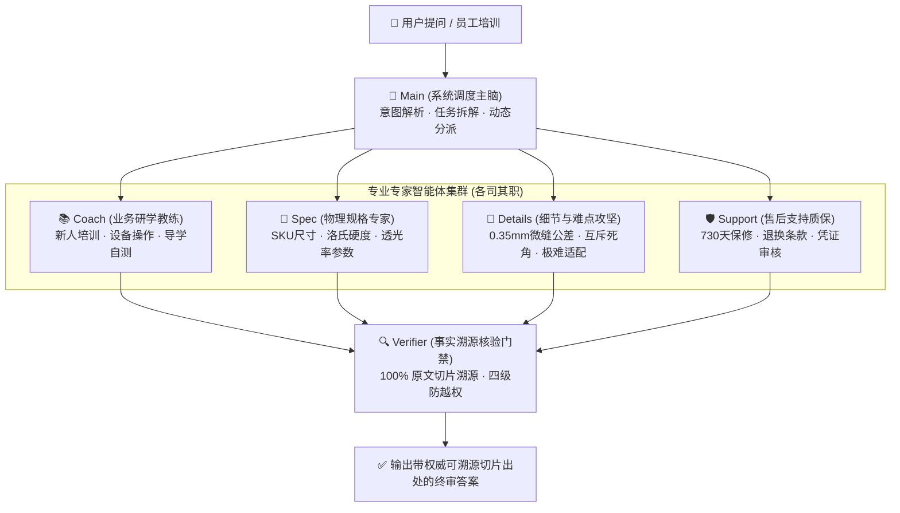

# TaoZhi-EcomAgent（淘智）：电商商品多智能体智能问答与核验中台

面向商品资料查询、适配咨询、客服售后与运营协作的企业级多智能体中台。Vue 3 提供登录、文档库、智能问答、组织管理和审核页面；FastAPI 统一执行权限；基于 LangGraph 与 Jev System-1 按问题调度专业智能体；PostgreSQL 与独立 Worker 保存任务、审核、来源及流程检查点。

本仓库公开代码、维护规则和软件文档。**整个 `data/`、企业资料、私有配置、本机维护文件 `AGENTS.md` 与个人学习文件 `项目说明.md` 均不上传。** 克隆代码不会获得原部署的资料、账号或数据库。

## 主要功能

- 公司 → 部门 → 小组 → 成员的组织结构，支持组织范围内的员工、组长、老板，以及负责系统管理的管理员。
- 员工级、组长级、老板级资料；密级与组织范围共同决定可见性，支持有期限的单文档读取和下载授权。
- 文档受限草稿、上传解析、版本、审批发布、私有附件与可核验引用。
- **6 大专职智能体全阵容协同**：系统调度主脑 Main、业务研学教练 Coach、物理规格专家 Spec、细节攻坚专家 Details、售后质保专家 Support 与事实溯源核验门禁 Verifier 各司其职，彻底杜绝单一模型幻觉。
- **高并发微秒级语义缓存中台**：自研向量矩阵点积近邻匹配引擎，大促热点高并发削峰（时延 < 15ms，0 LLM 开销），集成 Transactional Outbox 异步持久化与严格的 ACL 来源权限动态校验。
- **Jev System-1 毫秒级决策核**：实现强类型离散选择（Choice）、连续打分（Score）与布尔断言（Noul）原语，提供离线与机密任务零模型调用安全屏障与本地启发式规则兜底。
- **四路混合检索与 HyDE**：限定授权候选后，由 BM25、本地字符 TF-IDF、本地语义向量与 HyDE 假设性文档四路信号经 RRF 融合排序；本地回环嵌入不可用时秒级降级。
- 身份与来源在任务、审核、发布、历史答案和追问中重新验证，撤权后不能继续使用旧答案。
- 同源 HttpOnly 会话 Cookie、写操作 CSRF 校验、独立环境、审计及任务崩溃恢复。

| 身份 | 默认可见范围 | 默认操作 |
| --- | --- | --- |
| 员工 | 公司共享和本组员工级资料、单独授权资料 | 阅读、提问、查看本人任务 |
| 组长 | 上述资料与所负责团队的组长级资料 | 本范围资料维护和业务审核 |
| 老板 | 本公司业务资料，包括老板级机密 | 公司业务读写、机密及关键权限审批 |
| 管理员 | 公司共享资料、另外获得授权的资料 | 组织、账号、配置和系统审计 |

管理员不能自行取得业务机密；组长不能因任职而管理其他组；审核不会把审核人的权限借给提问者。

## 多智能体团队编制（Multi-Agent Roster）

系统采用 LangGraph 编排与 Jev System-1 离散决策机制，由 6 位专职智能体协同作业，各司其职，杜绝单一模型幻觉：



| 智能体标识 | 中文角色名 | 核心职责与边界契约 |
| :--- | :--- | :--- |
| **`Main`** | **系统调度主脑** | 负责意图识别与任务拆解派发，杜绝具体专家“既当裁判又当运动员”。 |
| **`Coach`** | **业务研学教练** | 专职新员工培训与设备操作指引，输出步骤化教程与防呆自测题。 |
| **`Spec`** | **物理规格专家** | 严守规格书白名单，核对 SKU 尺寸、厚度、洛氏硬度（9H）、透光率等物理指标。 |
| **`Details`** | **细节与难点攻坚** | **死磕 0.35mm 微缝公差、曲面微小弧度与互斥死角**，攻克极难适配场景。 |
| **`Support`** | **售后支持质保** | 严格核验 730 天保修、退换凭证与政策合规，严禁大模型幻觉越权承诺退款。 |
| **`Verifier`** | **事实溯源核验门禁** | 终审门禁，逐句核对 100% 原始文档切片出处，执行四级密级防越权拦截。 |

## 工作流与决策核


入库流程独立完成上传校验、解析、归属与密级确认、切片、来源登记、索引和发布审核。检索先限定授权候选，再由 BM25、本地 TF-IDF、本地语义向量与 HyDE（LLM 假设文档，可配置开关）四路信号经 RRF 融合排序；嵌入由仅监听回环地址的独立本地服务提供，服务不可用时自动降级为词法检索。切片、关系和记忆继承来源版本及权限。进度只输出中文阶段，核验完成前不流出正文。

老板级资料默认禁止外部模型；经老板明确允许 AI 处理并允许本次问题使用外部 AI 后才能调用。Sensenova 使用 OpenAI 兼容接口并保持直连，密钥只保存在部署环境。

## 技术架构与目录结构

| 部分 | 实现 |
| --- | --- |
| 前端 | Vue 3、TypeScript、Element Plus（简体中文） |
| 后端 | FastAPI，`/api`，统一会话和权限 |
| 决策核 | Jev System-1，离散 Choice、Score、Noul 原语 |
| 语义缓存 | 自研向量矩阵点积引擎 + Transactional Outbox 异步削峰 |
| Agent 编排 | LangGraph，多角色并发、证据核验、审核门禁 |
| 持久化 | PostgreSQL，Alembic 迁移 |
| 任务 | 独立 Worker，租约、心跳、执行版本与有限重试 |
| 部署 | Linux 用户目录运行时、Supervisor、单机多进程、K8s/HPA 编排 |

```text
src/ecom_copilot/enterprise/   在线业务、权限、语义缓存、Jev 决策核与工作流
src/ecom_copilot/             共享能力和隔离的离线模块
web/src/                     中文工作台、类型与同源 API
k8s/                         生产 Helm/Kubernetes 编排与 HPA 弹性伸缩清单
evals/                       固定评测基准与基线对比运行器
.github/workflows/           main 推送的 CI 与提交范围检查
.github/ISSUE_TEMPLATE/      四类中文反馈表单
.githooks/                   提交快照、消息和推送门禁
migrations/                  数据库迁移
scripts/                     部署、检查和维护命令
tests/                       单元测试与企业边界验收（当前 206 项用例全部通过）
data/                        本机业务资料和运行产物（忽略）
```

新增目录、接口、配置、迁移或脚本必须同步说明和验证。详细目录职责见 [项目结构](STRUCTURE.md)。本机维护约束和个人学习说明由维护者在部署主机保留，不作为公开仓库依赖。

## 本地部署

当前验证环境为 Linux x86_64、Python 3.10、Node.js 24、PostgreSQL 18。不需要服务器 Docker 权限，安装脚本在用户目录准备运行时；主机需提供编译工具和 Python。

```bash
git clone https://github.com/SenpeWang/test.git
cd test
bash scripts/install_runtime.sh
cp .env.example .env
# 在本机 .env 中填写模型配置；不要提交密钥
.venv/bin/python scripts/manage_database.py provision
ECOM_ENV_FILE="$PWD/.env.demo" .venv/bin/python scripts/manage_database.py demo
.venv/bin/python scripts/configure_services.py
make build-web
make start
```

演示入口为 `http://127.0.0.1:18501/`。独立演示环境的 `admin`、`staff`、`leader`、`boss` 密码均为 `123456`，正式环境拒绝此口令。演示初始化只建立明确标注的组织与权限样例；商品文件需自行通过文档库上传。没有资料或模型配置时，系统说明证据或配置不足。

远端部署可通过 SSH 转发访问；使用自己的部署账号、地址和 SSH 端口：

```bash
ssh -N -L 18501:127.0.0.1:18501 用户名@服务器地址
```

浏览器中的 `127.0.0.1` 指客户端电脑，转发连接需保持打开。正式服务默认监听回环地址；对外开放时应配置 HTTPS 和安全 Cookie，不能直接暴露演示环境。

## 开发与验证门禁

```bash
make install-hooks    # 启用提交与推送门禁，每份克隆执行一次
make check-repository # 检查已跟踪文件、秘密及目录登记契约
make lint-web         # ESLint、组件命名与格式检查
make format-web       # 显式整理前端，不自动暂存
make check-format     # 仅格式检查
make check-commits    # 新增提交的格式和公开内容检查
make test             # 独立测试库离线回归（当前 206 项用例 100% 通过）
make build-web        # TypeScript 检查与生产构建（0 错误）
make verify-browser   # 演示入口四身份浏览器验收
```

依赖锁为 `requirements.lock.txt` 和 `web/package-lock.json`。CI 在 main 推送后验证真实提交及消息、仓库边界、目录登记、ESLint、Prettier、组件命名、类型构建、数据库迁移和独立测试库的离线回归；不读取真实资料或调用付费模型。

## Git 提交规范与协作推送工作流（Conventional Commits & Push Governance）

为确保代码库历史清晰、可追溯且符合工程规范，本项目严格遵循 **Conventional Commits 1.0.0 + Angular 标准 + commitlint**，并执行全流程安全推送纪律。

### 1. 提交信息结构规范

```text
<type>(<scope>): <subject>

<body>
```

- **Header 规范**：
  - **Header 总长度不超过 100 字符**；
  - **`type` 类型清单（严格受限）**：
    | type | 说明 |
    | :--- | :--- |
    | `feat` | 新增业务功能或智能体能力 |
    | `fix` | 修复缺陷或逻辑异常 |
    | `refactor` | 重构，非修 bug 也非加功能 |
    | `perf` | 提升计算或检索性能 |
    | `style` | 代码格式调整（空格、分号等），非 CSS |
    | `docs` | 仅文档变更 |
    | `build` | 构建系统或依赖锁变更 |
    | `ci` | CI 配置文件与自动化脚本变动 |
    | `test` | 新增或修正测试用例 |
    | `chore` | 杂务（如 .gitignore 调整、结构微调） |
    | `revert` | 撤销某次提交 |
  - **`scope` 范围定义（三层级）**：
    采用 `<项目>/<模块>/<脚本>` 或 `<模块>/<脚本>`，如 `pipeline`、`enterprise/worker`、`web/src`；
  - **`subject` 描述**：
    必须包含中文说明，首字母小写、使用祈使句现在时、不以句号结尾。

- **树状多层级 Body（核心规范）**：
  从实际 `git diff` 出发，自底向上归并缩进，精准陈述每个组件的具体变更，杜绝“更新代码/优化”等空泛描述：
  ```text
  feat(enterprise/cache): 引入微秒级向量语义缓存中台

  src/ecom_copilot/enterprise/
     semantic_cache.py: 实现基于点积相似度的本地向量缓存与 LRU 淘汰
     worker.py: 在任务执行前注入缓存命中判定与 ACL 权限重验
  tests/
     test_memory.py: 补充缓存击中与权限撤销边界测试
  ```

### 2. 核心推送纪律与安全铁律

1. **绝对禁令：向 GitHub 推送前必须主动询问 Senpe 并获得确认**
   - 严禁任何未经 Senpe 同意的自动推送或私自推送；
   - 每次推送前，必须向 Senpe 完整展示待推送的 commit 信息、变动摘要与 SHA 哈希。
2. **本地 5 重校验必须 100% 绿灯通过**：
   - `python3 scripts/check_repository.py --tracked` 验证通过；
   - `make check` 编译全量通过；
   - `make lint-web check-format` 前端规范 0 警告 0 报错；
   - `make test` 206 项独立测试库回归 100% 通过；
   - `npm run build` 前端生产构建 0 错误。
3. **零敏感外流原则**：
   - 严防 `.env*`、`AGENTS.md`、`项目说明.md`、`data/` 私有原件与企业业务数据进入版本库。
4. **推送后三方一致性核验**：
   - 推送完成后，必须核对本机 `HEAD`、`origin/main` 与 GitHub 远端 `main` 分支 SHA 完全一致，并监控 GitHub Actions CI 构建通过。

## 当前边界

真实订单、库存和财务系统尚未接入，显示“未接入”；连接器只读，不自动退款、改价或修改订单。单机多进程已实现，多机高可用、企业 SSO、真实业务接入与异机备份需要单独部署验收。演示或测试事实不能作为经营数据。

## 贡献与反馈

前端采用 ESLint Flat Config 和 Prettier 的统一基线，组件使用 PascalCase，关键业务函数写中文 JSDoc。

仓库所有人完成检查后直接向 main 提交和推送，不要求 PR 或 Squash。提交与推送钩子检查实际 Git 内容，推送后核验本机 main、origin/main、GitHub main 的提交一致并等待 CI；禁止强推和绕过检查。问题与建议使用中文 Issue 表单。

反馈表单包括 Bug、功能建议、文档改进和使用问题；请提供场景、复现或预期结果，并去除凭据、客户信息及机密正文。仓库钩子需要主动安装，服务端保护以 GitHub 实际设置为准。
