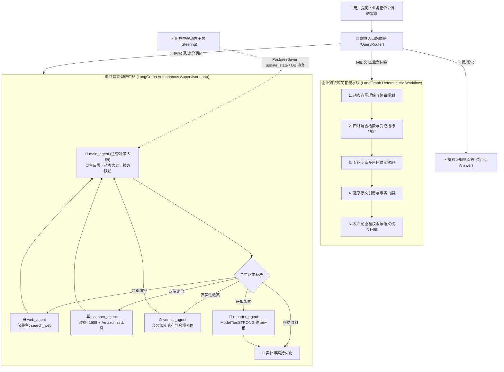

# TaoZhi-EcomAgent（淘智）：电商商品多智能体智能问答与核验中台

面向电商商品资料查询、适配咨询、客服售后、ChatBI 自然语言问数与市场全景调研的企业级多智能体中台。系统采用“双核驱动”架构：
1. **企业知识库问答（KB QA）**：基于 **确定性工作流（Deterministic Workflow via LangGraph DAG）**，执行严格的组织权限隔离、逐字原文引用核验门禁、零幻觉阻断与受控指标早置越权拦截；
2. **电商智能市场调研（Market Research）**：基于 **真·自治多智能体系统（Autonomous Multi-Agent System via LangGraph Supervisor Loop）**，由主管决策中枢（`main_agent`）自主反思与动态委派，彻底摒弃固定流水线与虚假百分比进度条，具备真正的图环路、运行期动态干预（Mid-Flight Steering）与 5 大业务可审计字段沉淀。

本仓库公开代码、维护规则与软件文档。**整个 `data/` 目录、企业机密原件、私有环境配置（`.env*`）、本机维护规则 `AGENTS.md` 与个人学习文件 `项目说明.md` 严禁提交。** 克隆代码不会获得部署环境的私有资料、凭据或业务数据库。

---

## 一、 系统核心功能矩阵

- **组织权限与多租户硬隔离**：公司 ➔ 部门 ➔ 小组 ➔ 成员四级组织树，提供 `staff`（员工）、`leader`（组长）、`boss`（老板）与 `admin`（系统管理员）严格的 RBAC 访问控制。
- **密级与时效控制**：划分 L1（公开）、L2（内部）、L3（机密）三级数据密级，支持细粒度文档临时授权、到期自动撤权与单文档下载权限管控。
- **逐字原文溯源门禁（Quality Gate）**：企业问答结论必须逐字回溯已获准阅读的切片原文出处，未获许可或无依据内容坚决拒答。
- **高并发微秒级向量语义缓存**：自研向量矩阵点积近邻匹配引擎，大促热点并发秒级削峰（时延 < 15ms，0 LLM 开销），集成 Transactional Outbox 异步持久化与 ACL 动态复验。
- **编排层离散决策引擎（DecisionEngine）**：实现强类型离散选择（`Choice`）、连续打分（`Score`）与布尔断言（`Verify`）原语，提供本地语义向量近邻直选、规则兜底与离线任务零模型安全屏障。
- **四路混合检索与语义增强**：限定授权候选后，由中文 BM25、字符 TF-IDF、本地语义向量与 HyDE（假设性文档）四路信号经 RRF（Reciprocal Rank Fusion）融合排序。
- **受控自然语言问数（ChatBI）**：指标意图基于别名强匹配与 Jaccard 词重叠门控识别；越权指标早置拦截；SQL 永远基于白名单指标模板受控组装，严禁由大模型盲写 SQL。
- **安全与容灾恢复**：HttpOnly 会话 Cookie、写操作 CSRF 防御、分布式租约锁（Lease Fencing）、看门狗超时自愈与 PostgresSaver 检查点断点恢复。

---

## 二、 架构总览：双核驱动编排机制


```mermaid
flowchart TD
    User["👤 用户提问 / 业务指令 / 调研需求"] --> Router["🧭 前置入口路由器 (QueryRouter)"]

    Router -->|问候/常识| DirectAns["⚡ 毫秒级规则直答 (Direct Answer)"]
    Router -->|内部文档/业务问数| KBWorkflow["🏢 企业知识库问答【确定性工作流】"]
    Router -->|全网/货源/比价调研| ResearchAgents["🤖 电商智能调研【真·自治多智能体系统】"]

    subgraph KBWorkflow["企业知识库问答流水线 (LangGraph Deterministic Workflow)"]
        direction TB
        Plan["1. 动态意图理解与路由规划"] --> Retrieve["2. 四路混合检索与受控指标判定"]
        Retrieve --> SpecialistRun["3. 专职专家多角色协同核验"]
        SpecialistRun --> QualityGate["4. 逐字原文引用与事实门禁"]
        QualityGate --> Pub["5. 发布前重验权限与语义缓存回填"]
    end

    subgraph ResearchAgents["电商智能调研中枢 (LangGraph Autonomous Supervisor Loop)"]
        direction TB
        Supervisor["🎯 main_agent (主管决策大脑)<br>自主反思 · 动态大纲 · 状态跃迁"]

        Supervisor --> S_Router{自主路由裁决}
        S_Router -->|网页情报| Web["🌐 web_agent<br>仅装备: search_web"]
        S_Router -->|双端比价| Scanner["🏭 scanner_agent<br>装备: 1688 + Amazon 双工具"]
        S_Router -->|真实性验真| Verifier["⚖️ verifier_agent<br>交叉核算毛利与合规去伪"]
        S_Router -->|研报架构| Reporter["📑 reporter_agent<br>ModelTier.STRONG 终审研报"]
        S_Router -->|完结收敛| Persist["💾 实体事实持久化"]

        Web --> Supervisor
        Scanner --> Supervisor
        Verifier --> Supervisor
        Reporter --> Persist
    end

    SteerAction["⚡ 用户中途动态干预 (Steering)"] -.->|PostgresSaver update_state / DB 事务| Supervisor
```

---

## 三、 专职电商多智能体作业团队（Research Roster）

智能调研体系采用 **LangGraph Supervisor 闭环架构**，彻底杜绝死板的固定顺序与虚假百分比进度：

| 智能体标识 | 角色名称 | 绑定工具集 (Tools) | 核心职责与任务边界 |
| :--- | :--- | :---: | :--- |
| **`main_agent`**<br>(`main`) | **调研协同总指挥**<br>(Supervisor) | *(调度原语)* | **中央决策大脑**：意图理解、探索维度大纲制定、动态任务拆解、专职智能体分派、审查反馈事实充分性与动态重规划。 |
| **`web_agent`**<br>(`web`) | **全网市场情报专员** | `[search_web]` | **专注全网网页检索**：通过 DuckDuckGo 与自建检索网关抓取主流品牌热销卖点、行业最新趋势与买家差评痛点。 |
| **`scanner_agent`**<br>(`scanner`) | **货源比价专员** | `[search_1688_wholesale,<br>search_amazon]` | **双渠道供应链与出海比价**：深入 1688 批发平台抓取一手源头工厂出厂底价与起订量阶梯；对标海外亚马逊跨境终端美元售价。 |
| **`verifier_agent`**<br>(`verifier`) | **商品真实性验真专员** | `[cross_verify_margins]` | **交叉验真与毛利测算**：比对零售端宣称与工厂实际制造工艺，测算供应链到零售端的真实毛利空间，剔除虚假夸大营销。 |
| **`reporter_agent`**<br>(`reporter`) | **电商调研研报专家** | `[generate_markdown_report]` | **结构化研报编排**：由 `ModelTier.STRONG` 强力驱动，聚合多智能体客观发现，生成严谨专业的全景 Markdown 研报工件。 |

### 生产级可审计工程原则（杜绝倾倒 CoT 思维链）
- **客观进度推进**：自治智能体探索深度由模型自主决定，无法预知步骤，运行期仅以**决策轮次（Turn 1, Turn 2...）**推进，不搞“20% ➔ 50% ➔ 100%”等虚假百分比；
- **全量沉淀 5 大审计信标**：不向前端倾倒大模型长篇 CoT 草稿，精准持久化：
  1. `tool_name`：调用的物理工具（如 `search_1688_wholesale`）；
  2. `parameters`：工具实际接收的结构化参数（如 `{"query": "保温杯", "limit": 15}`）；
  3. `result_summary`：提炼的结构化客观事实（如：“提取 15 家工厂，出厂底价 4.5~12.0 元”）；
  4. `state_transition`：状态机与角色权杖跃迁（如 `main_agent:REASONING ➔ scanner_agent:DISPATCHED`）；
  5. `decision_rationale`：主脑调度该专职智能体的业务决策理由。

---

## 四、 技术架构与模块规范

| 架构分层 | 核心技术选型 | 职责边界 |
| :--- | :--- | :--- |
| **接入层 (API)** | FastAPI、Uvicorn、HttpOnly Session、CSRF | 统一会话鉴权、权限上下文加载、流式 SSE 事件输出、中途动态干预端点。 |
| **编排层 (Orchestration)** | LangGraph、StateGraph、DecisionEngine | 企业问答确定性流水线编排、多智能体 Supervisor 循环、离散选择与打分核验。 |
| **智能体中台 (Agent Core)** | SubagentRunner、MessageBus、SubagentContext | 专职智能体沙箱执行、双轨行索引记忆（`TranscriptLogger`）、阶梯压实（`ContextCompactor`）。 |
| **知识与检索层 (RAG)** | ES BM25 + pgvector HNSW + RRF + BGE-M3 | 混合检索排序、向量语义缓存、知识库切片解析、Prompt 防注入守卫。 |
| **存储与基础设施** | PostgreSQL 18、Kafka、MinIO、Alembic | 状态机任务表（`jobs`）、事务发件箱（`task_outbox`）、事件流水（`task_events`）、分布式租约锁。 |
| **前端交互中台** | Vue 3、TypeScript、Element Plus、Vite | 响应式工作台、模块化视图（`DocumentManager`、`PolicyMatrix`、`TaskTimeline`、`ResearchChatView`）。 |

### 模块目录映射

```text
src/taozhi/
├── api/                     接入层：同步问答、会话与系统健康检查
├── orchestration/           编排层：真·自治多智能体中枢 (agent_system)、离散决策引擎 (decision)
├── agents/                  专职电商智能体模板与统一注册中心 (registry)
├── core/
│   ├── agent/               智能体生命周期状态机、上下文沙箱、双管道事件中枢
│   ├── compaction/          上下文治理、阶段压实与事实硬兜底
│   ├── memory/              长效实体记忆库、双轨日志与会话投影
│   ├── tools/               工具执行器、1688/Amazon/Web 工具集、行边界保持截断
│   └── skills/              渐进式技能中心与斜杠指令集
├── knowledge/               知识库切片入库、混合检索器、数据库连接与语义缓存
├── server/                  FastAPI 路由服务、权限策略 (policy)、异步 Worker 守护进程
├── schemas/                 请求响应 DTO、Agent 状态机契约与全链路 Trace 规范
└── observability/           全链路树状 Trace 收集器 (tracer) 与 Arize Phoenix 导出器
```

---

## 五、 本地部署与快速上手

当前验证基线环境为 Linux x86_64、Python 3.10、Node.js 24、PostgreSQL 18。无需 Docker 权限，一键脚本在用户目录准备独立隔离运行时：

```bash
# 1. 克隆代码仓库
git clone git@github.com:SenpeWang/TaoZhi-EcomAgent.git
cd TaoZhi-EcomAgent

# 2. 安装本地隔离运行时与依赖
bash scripts/install_runtime.sh
cp .env.example .env
# 在 .env 中填入大模型与向量服务配置 (切勿提交真实密钥)

# 3. 初始化数据库结构与基础数据
.venv/bin/python scripts/manage_database.py provision
.venv/bin/python scripts/configure_services.py

# 4. 构建前端并启动服务
make build-web
make start
```

- **工作台访问入口**：`http://127.0.0.1:18080/`
- **默认评测演示账号**：`syn_staff1` ~ `syn_staff4`（员工）、`syn_leader1`（组长）、`syn_boss`（老板）、`syn_admin`（管理员），统一口令 `taozhi2026eval`。

---

## 六、 科学评测体系（Evals Benchmark）

项目拥有独立于业务运行时的科学评测资产库 `evals/`：
- **三层金字塔评测**：
  1. **检索层（Retrieval）**：评测 Hit@1/3/8、Precision@K、Recall@K、MRR、nDCG 检索排序质量；
  2. **对抗安全层（Adversarial）**：全自动机读规则验证防注入、越权阻断、撤权即时失效与敏感脱敏；
  3. **行为质量层（Behavior）**：覆盖同义/错字鲁棒性、多轮指代消解与依据忠实度（Faithfulness）。

```bash
make evals-tests     # 仅跑评测代码自身的单元测试 (2 秒秒级返回)
make evals-quick     # 检索层 + 对抗层快速门禁验证 (约 5 分钟)
make evals-full      # 三层全量深度回归评测 (对比 baseline.json，不达标退出码 1)
make evals-pipeline  # 全量评测并自动同步全链路 Trace 轨迹至 Arize Phoenix 平台
```

---

## 七、 5 重工程质量门禁与协作规范

在向代码库提交与推送到远端之前，必须 100% 绿灯通过以下 5 重门禁：

```bash
# 门禁 1: 检查已跟踪公开文件、无秘密外流及目录登记契约
python3 scripts/check_repository.py --tracked

# 门禁 2: Python 全局语法与导入静态编译 (0 错误)
make check

# 门禁 3: 前端 ESLint、Prettier 格式化检查
make lint-web check-format

# 门禁 4: 自动化测试套件全量回归 (当前 208 项用例 100% 通过)
make test

# 门禁 5: 前端 TypeScript 类型检查与生产构建打包
cd web && npm run build
```

### Git 提交规范（Conventional Commits）
本项目严格执行 Conventional Commits 1.0.0 规范：
- **Header 结构**：`<type>(<scope>): <subject>`（长度 ≤ 100 字符，必须包含中文说明，首字母小写，末尾无句号）；
- **限定 Type（11类）**：`feat|fix|refactor|perf|style|docs|build|ci|test|chore|revert`；
- **树状多层级 Body**：必须从 `git diff` 出发，自底向上按文件逐项陈述具体变更，严禁“优化代码/更新”等空泛描述；
- **推送铁律**：向 GitHub 推送前必须向 Senpe 展示提交摘要与 SHA 哈希并获得明确许可，严禁私自推送或强推。
